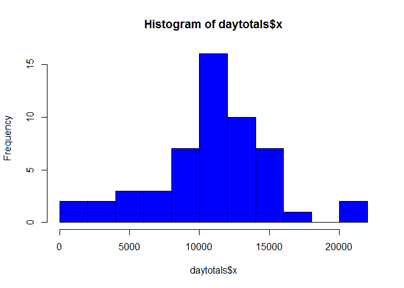
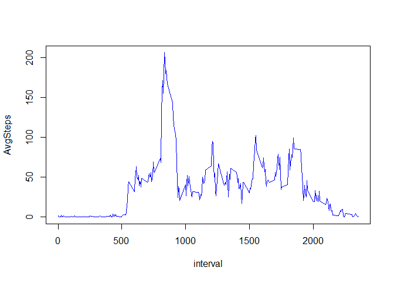
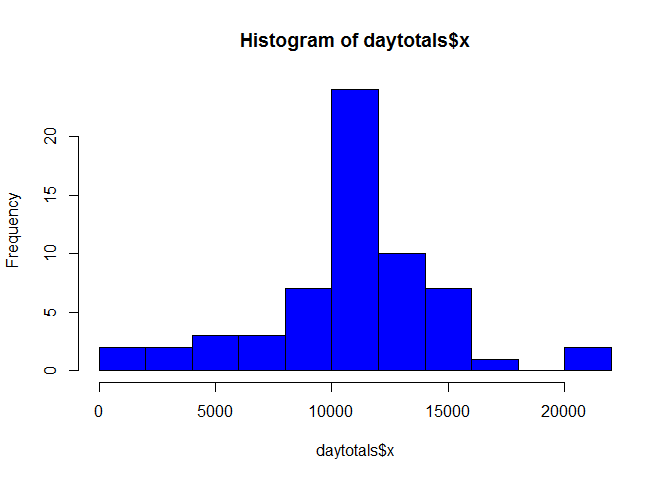

# Reproducible Research: Peer Assessment 1


## Loading and preprocessing the data

```r
data<-read.csv("activity.csv")

#get weekdays, make data column
data$days<-weekdays(as.Date(data$date))

#get data without NA for histogram
good<-!is.na(data$steps)
gdata<-data[good,,]
```

## What is mean total number of steps taken per day?

```r
#get sum per day
daytotals<-aggregate(gdata$steps, gdata["date"], sum)

hist(daytotals$x, breaks=11, col="blue")
```

 

```r
mean(daytotals$x)
```

```
## [1] 10766
```

```r
median(daytotals$x)
```

```
## [1] 10765
```

## What is the average daily activity pattern?

```r
library(data.table)
gtable = as.data.table(gdata)
plotData = gtable[,list(AvgSteps=mean(steps)),by=interval]
plot(plotData, type="l", col="blue")
```

 

```r
#get interval with maximum average steps
plotData[, plotData[AvgSteps==max(plotData$AvgSteps)]]
```

```
##    interval AvgSteps
## 1:      835    206.2
```

## Imputing missing values

```r
#number of missing values
nrow(data)-nrow(gdata)
```

```
## [1] 2304
```

```r
#fill in missing data with mean of same interval
idata<-data
for (i in 1:nrow(idata)) {
  if(is.na(idata$steps[i])){
    idata$steps[i] = plotData[, plotData[interval==idata$interval[i]]]$AvgSteps
  }
}

#make new histogram
daytotals<-aggregate(idata$steps, idata["date"], sum)

hist(daytotals$x, breaks=11, col="blue")
```

 

```r
mean(daytotals$x)
```

```
## [1] 10766
```

```r
median(daytotals$x)
```

```
## [1] 10766
```

The new mean is the same as the old mean, as is the median.

## Are there differences in activity patterns between weekdays and weekends?
